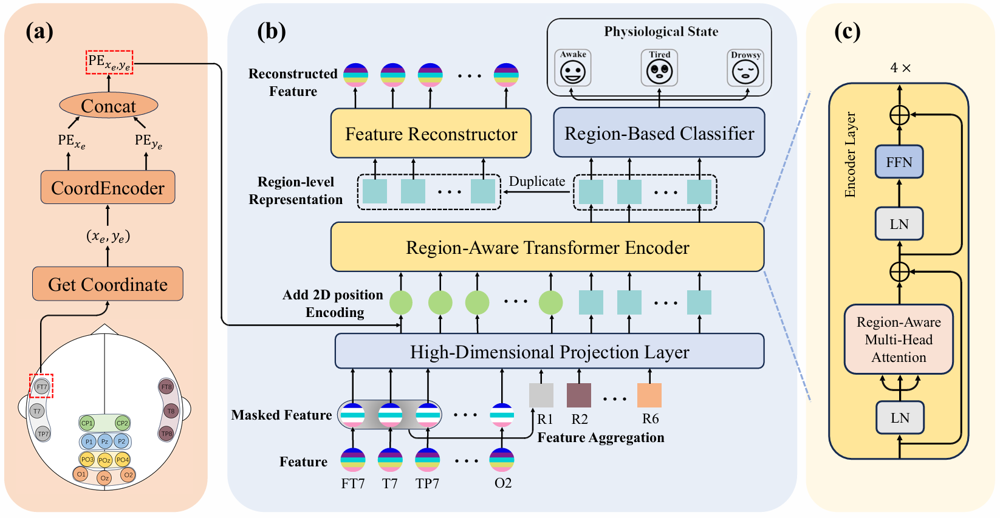

# A Multi-Stage Learning Framework Integrating Reconstruction and Classification for Region-Level EEG-Based Fatigue Detection
This repository provides the implementation of our paper on EEG-based fatigue detection. We propose a multi-stage learning framework that integrates joint pre-training and supervised fine-tuning to improve fatigue recognition performance.

  

The figure above illustrates our proposed **two-stage EEG-based fatigue detection framework**. 
The model consists of two main stages:

1. **Joint Pre-training Stage**  
   In this stage, the model is jointly trained with reconstruction and classification tasks, all parameters in the model are trainable.

2. **Supervised Fine-tuning Stage**  
   In this stage, the pretrained encoder is transferred to a classification model consisting of the frozen encoder and a newly initialized classifier.
   All encoder parameters are frozen, and only the classifier is optimized under labeled supervision.
